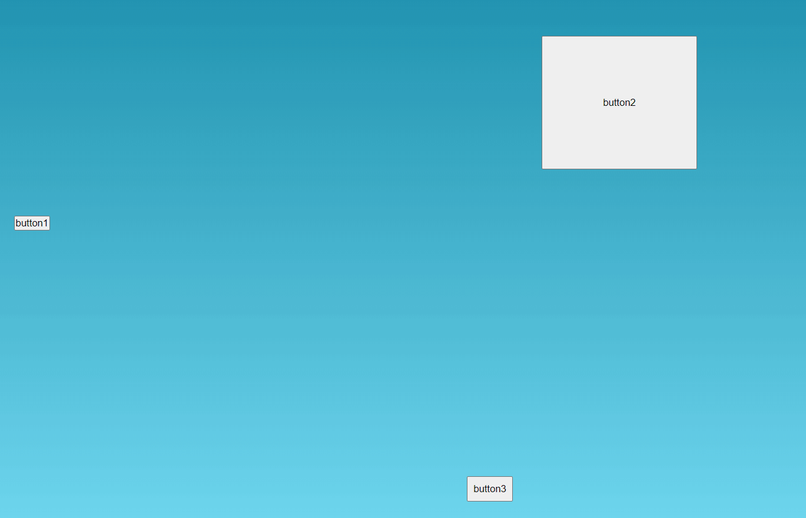

## Руководство | Интерактивные подсказки
 Задумка интерактивные подсказки и руководства для интерфуйсов ( отвечают на вопрос что делать этой кнопкой и проводит инструктаж)
1. затемнение области крана
2. затемнение с возможностью подсветить обьект (кнопку)
3. окно с текстом  + если подсвечена кнопка то не перекрывают друг друга
4. картинка под текстом может быть а может не быть

 Функция должна вызывать цепочку действий допустим есть кнопка после ее нажатия открывается панель
 и у нее подсвечивается  кнопка после нажатия другая происходит либо шаг и открытие другого окна с подсветкой и текстом либо завершение
после крайнего действия удаление всех вызовов

<div align="left">



#
## Проект сожержит
<details>
  <summary >TypeScript</summary>

  [Что это?](https://www.typescriptlang.org/)

    TypeScript is JavaScript with syntax for types.
    TypeScript is a strongly typed programming language that builds on JavaScript, giving you better tooling at any scale.

</details>

<!-- 
<details >
  <summary >VueX</summary>
 
  [Что это?](https://vuex.vuejs.org/) 
 
    Централизованное хранилище данных для всех компонентов приложения.
    Логика вынесена в отдельный модуль, входной точкой является файл store/index.js
</details>


<details >
  <summary > Vue router</summary>
 
  [Что это?](https://router.vuejs.org/) 

    Роутиг на страницах осуществляется через [<router-view>] без перезагрузки
    шапка сайта остается неизменной и не загружается при смене страниц
</details>

<details>
  <summary>SCSS</summary>
 
  [Что это?](https://sass-scss.ru/)  

    Вы можете изменять  настройки в вашем проекте. 
    Для  автоматического комполирования файлов css необходимо запустить 

  Live Sass Compiler 

  [Что это?](https://marketplace.visualstudio.com/items?itemName=ritwickdey.live-sass)  

    В проекте scss создает 2 css файла style-light style-dark 
    для разных цветовых тем.

    Конфигурации нужно изменять в файлах variables_light.scss variables_dark.scss 
</details>

<details>
  <summary>Локальный сервер</summary>
 
  [Что это?](https://ru.wikipedia.org/wiki/Localhost) 
 
  По умолчанию [localhost:8080](http://localhost:8080).
</details>
 -->

# 
## Для запуска потребуется
- этот репозиторий 
 ```
git clone https://github.com/VladislavBobyrev/
```
- node.js 
 
```
https://nodejs.org/en/
```

<!-- - Live Sass Compiler -->

 
<!-- ```
https://marketplace.visualstudio.com/items?itemName=ritwickdey.live-sass
``` -->

- браузер

#
## Команды

|                        |                       |
|------------------------|:----------------------|
| Установить зависимости | `npm i`               |
| Запустить локально     | `tsc --watch src/service/index.ts`       |

 
#
## Связвться со мной
<div align='center'> 
 
 ```
vladislavbobyrev@yandex.ru
```
 
 [](https://t.me/VladislavBobyrev)

 </div>
 
<div align="center">
  <h2>**ВНИМАНИЕ!**  Вся конфигурация является открытой. </h2>
 
**ВНИМАНИЕ!** На компьютере должны быть установлены программы `node` и `npm`.
Генерация  занимает много времени за счёт
установки `node_modules`. Необходимо дождаться окончания этого процесса.
 
</div>
